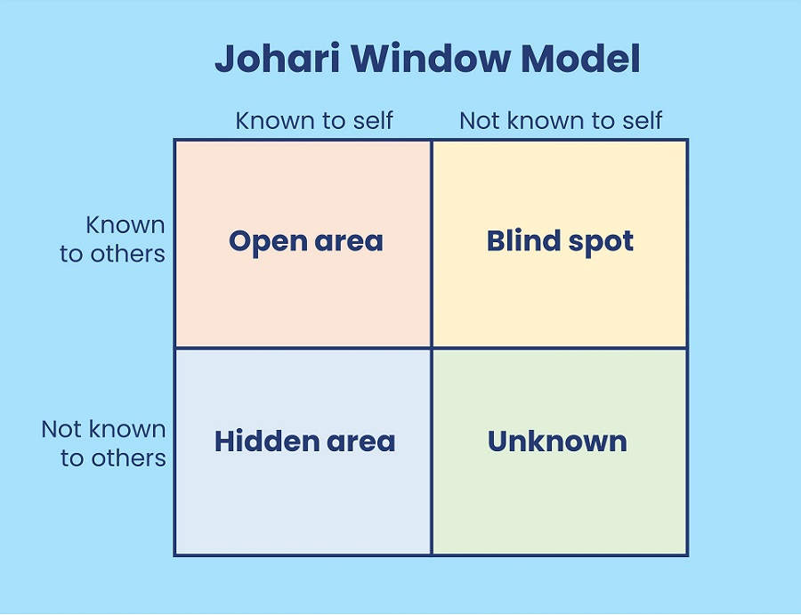

## My Developer Journey

I've been coding since 2012, starting with Java, then for about a year working as an intern I did some Ruby (on Rails).
Then I returned to college to get a 2nd degree, this time in Computer Science where C# was the focus. After that more intern work, this time with
Php and Java Selenium testing. I got sick of this job pretty quick since there was only interns and no one senior to learn from. This forced me
to look abroad for work. I got my first full paid job as a developer in Amsterdam working for a small 20 persona digital agency. I stayed at
this job for about 4.5 years and got to work on a bunch of different stuff, starting with a bunch WordPress and then React where I got to build
some real applications (web & mobile), games and interactive experiences. Then In 2019 I decided to go freelance and ended up working on
Polestar's website for 5 years. This is where I got to work with Typescript and Gatsby. But then...

# All good things...

There were some substantial budget cuts at Polestar and as a freelancer I was let go. I decided to take a break and maybe work on some personal
projects, like this blog. I also visited China for the first time with my Fiancé, and we moved to our first apartment. I spend a bunch of time
painting tiling and building furniture.

The house was ready and the money I had saved from Polestar was running out, so I started looking for work. I had heard of constant layoffs,
especially in tech (mostly gaming since I follow a lot of gaming news). So I was a bit worried about finding work. But I started applying for
a lot of jobs via the easy apply on LinkedIn... no responses. I reach out to friends & old colleagues and get some numbers and emails but still
no responses. So I started putting in more effort, I wrote like 20 (mostly unique) cover letters in a week (also, NO Chat Gippity). Finally, some
responses... rejections... but responses.

Eventually I got some interviews, but something had changed, there was a lot more expectation, a lot more competition. They all wanted live code
challenges or take home assignments, 10 years in the industry wasn't enough proof that I could build their smooth brain ReactJS app!?!? The first
rejection was a shock, the interview went well, the assignment was correct, I even submitted the optional extra part. I had a good back and forth
with one of the guys & and okay one with the other. The following day I was rejected with feedback that didnt match the interview.

# The Biggest Lie

This scenario played out 5 or 6 times, positive in the interviews, positive about assignments & then rejection. The Dutch are known for being
direct, its part of the culture that I love, but interview after interview people lied to my face about what they thought of the work I had done.

The process was also too long, weeks between 1st and 2nd interviews, poor communication lines, unclear requirements and tonnes of generic
HR/Recruiter babble. So I spent some time blaming the shitty interviewers and shitty companies, I knew I could build their simple systems
with my eyes closed. They were just gate keeping till they get someone crazy overqualified for the job.

But something didn't sit right with me, I took some time to reflect on my work, my past jobs & how my old team communicated about work.
Maybe something else was going on here.

# The Real Biggest Lie

As a Jr Dev people blow smoke up your ass if you do anything competent. They tell you your great and your a rockstar because you built a basic
WordPress and were only 1 month over deadline. Mid & Senior devs are probably just happy that you didn't break anything or didnt bother them
with questions a simple Google search would answer. In my career I basically never got negative feedback and that's really the biggest lie.
I certainly messed up a lot, I made things inefficiently, I mismanaged time and created avoidable bugs. But these things never really got
highlighted I never got that feedback, I never got that opportunity to grow.

There's a psychological exercise/technique you can do called the Johari window. The idea is to catch blind spots in your understanding of
yourself.

The exercise helps you build a realistic/full picture of yourself. This helps identify shortcomings and point out things you need to improve.
Only though other people can you gain the full picture, feedback is essential to the process.

When people only ever tell you that you're doing a good job why should I work harder??? With this reflection I thought my old colleagues, weak
managers and bad bosses were to blame. But once again I was wrong.

# The Hard Truth

I was the problem. I was the one who was overconfident, I was the one who was under-prepared. I was the one who was too comfortable in my job,
building react apps that were so simple we didnt even have a state management library. Funnily enough, this revelation came to me from someone
who actually gave me real feedback on my career and my work, just not directly. I mentioned him in the last post, [ThePrimeagen](https://youtube.com/@ThePrimeTimeagen).
If you need motivation or a reality check I highly recommend his channel. He brings some nuance to the conversation about being a developer,
questioning the status quo and the way we think about our work.

I have been a React Andy, a simp for JS/TS for too long. The last few years I've build things that have almost no complexity and no real coding
challenges. Sticking together libraries that real devs have built.

Knowing that I suck means I can try to suck less.

In the end you get out what you put in, and I haven't been putting in enough. You don't want to hear it and I don't want to hear it but to be a
truly great dev takes hard work and dedication.

